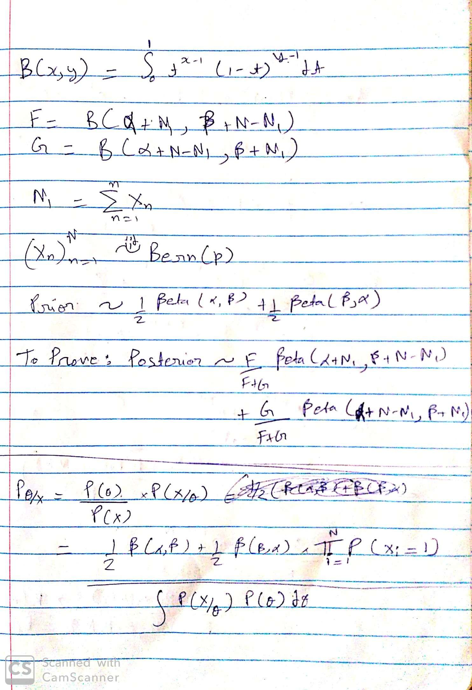
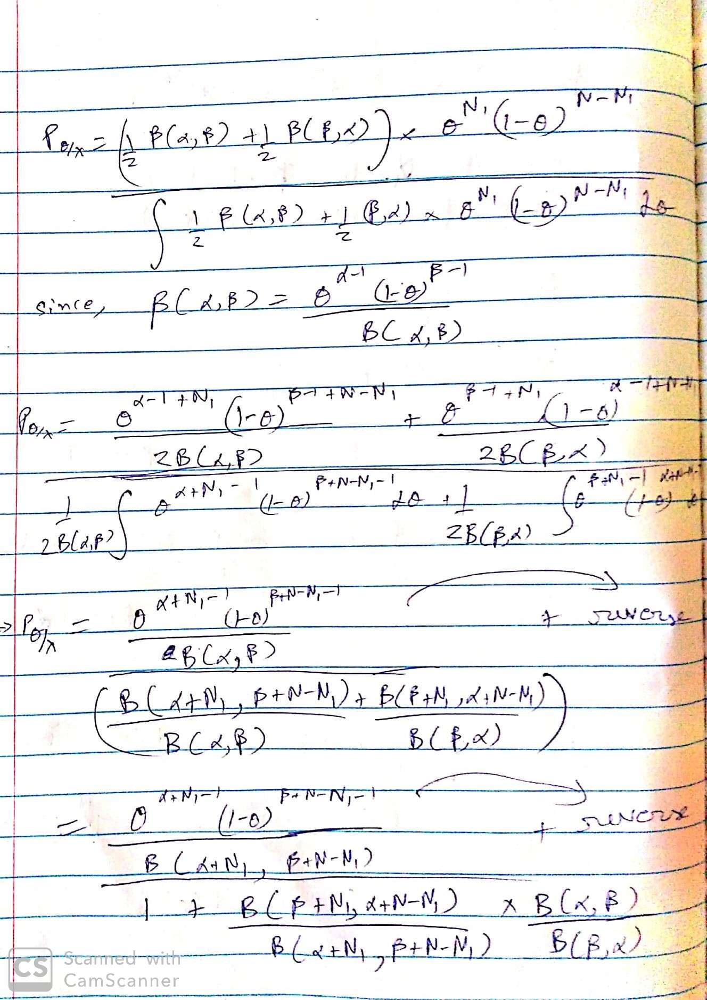
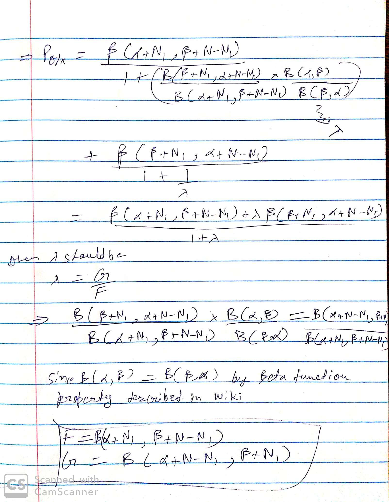

```{python setup, include=FALSE}
import pandas as pd
import numpy as np
```


## Frequentist Characterizations of Uncertainty:

- If we repeated the process of creating confidence intervals more times with more samples, we’d expect ~ 95% of them to contain the value of the population parameter. 
- The above statement is precise, and correct. However it is a little long, thus in practice we often say the following instead: 
  - We are 95% “confident” that the value of the population parameter is somewhere within the 95% confidence interval we calculated. 

- A 90%-confidence interval (one-sided) is a random interval that contains a fixed parameter of interest with probability 90% before observing random data. 


- $\bar X - \frac{\alpha \sigma}{\sqrt{M}} \leq \mu \leq \bar X + \frac{\alpha \sigma }{\sqrt{M}}$ where  2α  is the length of the standard normal 95% probability interval.
  - Not a valid confidence interval for μ: this is an asymptotic confidence interval assuming we have enough data that the sample mean is roughly normal by CLT. In fact, our height distribution is probably bimodal (men + women). 


## Why Bayesian

Even a minor change to a simple problem makes things significantly harder for frequentist methods. Bayesian methods often have good frequentist properties. 

**Example** 

Say you collect some yearly log returns $X_1, \dots, X_M$ for a financial asset, and use $\frac{1}{M}\sum_{i=1}^M X_i$ to estimate the average. But real log returns exhibit a very high variance which is difficult to capture using a normal distribution. If we model $X_i$ with a Cauchy Distribution then we can't use asymptotic confidence intervals because Cauchy distributions have infinite variance! Could use bootstrap, but that also doesn't give exact conf interval. 


The Bayesian statistical approach addresses these challenges. 

- very flexible, handles most analysis settings 
  - missing data, non-standard data types, non-iid, weird loss functions, adding expert knowledge 
  - Frequentist: every problem is a new problem - Bouchard-Cote 
  - Bayesian: every problem is the same, but your computer might disagree... 
- valid inference for any (finite) amount of data 
- super easy to interpret uncertainty 
- posterior is a "one-stop-shop" for prediction, inference, decision-making 
- recursive updating 

But... 

- often need to be much more careful about computation (scalability) 
- requires slightly more model design work (prior) 
- less widely used in some areas of practice, e.g., medicine 
  - this is changing 


 

**Bayes' Rule for probability density:** *The posterior is proportional to the likelihood times the prior* $f_{\Theta | X}(\theta; x) \propto f_{X | \Theta}(x; \theta) f_{\Theta}(\theta)$ 


## Generative Models

- Generative = can be used to make synthetic / fake data 
- Mathematical model for reality; "story about how your data were created" 
- rule of thumb: if your model can generate it, it will be handled in inference 
- Determinstic generative model = no room for noise. Like Newton's Law of Motion 
  - Predictions will always be the same 
  - Can't account for a model simplifications (model has to be perfect) 

### Probabilistic generative models

- We design models using probability theory to add wiggle room to everything 

- If you've ever "fit" a non-probabilistic generative model using data (e.g. least squares), you were actually using a probabilistic generative model under the hood 


**Model Formulation** 

$X_i \sim \mathrm{Bern}(p)$, $i=1, \dots, M$

$p$  is the unknown parameter we want to estimate
$X_i$ are the results of each bottle cap toss (1 = right side up, 0 = upside down)
$X_i$ is 1 with probability $p$


```{python Generative Model, eval=FALSE}

#JAGS model code
jags_code = '''
model{
    for (i in 1:N){
        X[i] ~ dbern(p)
    }
}
'''

#JAGS data (here "data" = anything that is fixed + known)
#note that X are our observations, but since we're generating
#them synthetically, they aren't "data" here
jags_data = {
    'N' : 3,
    'p' : 0.7
}

#compile the model
model = pjs.Model(code = jags_code, data = jags_data, chains = 2)

#generate synthetic data
samples = model.sample(iterations = 5, vars=['X'])

#print the samples
print(samples['X'].shape)
print(samples['X'])


```


`samples['variable_name']` which returns the samples for `variable_name` has shape  $D×N×C$ , where 
D=  number of dimensions (here, 3) 
N=  number of samples (here, 5) 
C=  number of chains (here, 2), i.e., number of repetitions of sampling 
For now, we can just set  C=1 . Later we'll see why more chains can be useful. 


### Frequentist Approach to Estimation the probability

- Bernoulli likelihood for one toss: $\mathbb{P}(X_i = x) = p^{x}(1-p)^{1-x}$ 

- Bernoulli likelihood for  N  tosses: $\prod_{i=1}^N p^{X_i}(1-p)^{1-X_i}=p^{\sum_i X_i}(1-p)^{N - \sum_i X_i}$ 

- Take the derivative and set it to 0: $\hat p = \frac{1}{N}\sum_{i=1}^N X_i$ 

- If N=3, there are only 4 possible values the estimate can take. This is not reasonable and it is a big problem when data is small. 


**Measuring uncertainty in p **


```{python bootstrapping, eval=FALSE}
np.random.seed(1)

#Input our data here
x = np.array([0, 1, 0])

#We compute our point estimate
p_est = x.mean()

#let's look at the bootstrap distribution of p_est
N_bootstrap = 1000
p_bootstrap = []

for i in range(N_bootstrap):
   
    #take a bootstrap sample of size M from x
    x_bootstrap = np.zeros(x.shape[0])
    for j in range(x_bootstrap.shape[0]):
        x_bootstrap[j] = x[np.random.randint(x.shape[0])]
    
    #compute the p estimate
    p_est_bootstrap = x_bootstrap.mean()
    
    #add the bootstrap sample estimate to the list
    p_bootstrap.append(p_est_bootstrap)

#print the actual data and estimate
print('data: ' + str(x))
print('p_est:' + str(p_est))
    
#plot a histogram of the bootstrap sample
plt.hist(p_bootstrap)
plt.ylabel('Count')
plt.xlabel('p')
plt.show()

```


### Bayesian Approach

Let's try a slightly different generative model where we specify how both  $p$  and  $X_i$  are generated. Earlier we didn't need to specify the p is generated (distributional assumption) 

The distribution of our parameter $p$ is called the prior 
The distribution of our data  $(Xi)^M_{i=1}$  given $p$ is called the likelihood 


```{python Bayesian, eval=FALSE}

#JAGS model code
jags_code = '''
model{
    p ~ dbeta(1, 1) 
    for (i in 1:N){
        X[i] ~ dbern(p)
    }
}
'''

#note: p is no longer "data", since we're trying to infer it!
#X is data now since we observe it
jags_data = {
    'N' : 3,
    'X' : np.array([0, 1, 0])
}

#compile the model
model = pjs.Model(code = jags_code, data = jags_data, chains = 1)

#take 1000 samples of conditional distribution of p given X
samples = model.sample(10000, vars=['p'])

#print the samples
print(samples['p'].shape)
print(samples['p'].flatten()[:10])


#plot the sample histogram
plt.hist(samples['p'].flatten(), bins=100)
plt.ylabel('Count')
plt.xlabel('p')
plt.show()

```


## Generative Model


**Example:** I'm going to flip two bottlecaps, with $X, Y \in \left\{0, 1\right\}$. They have probability of landing right side up (value 1) $p = 0.7$. 

- if the 1st one lands right side up ($X = 1$), I will cheat and force the 2nd one to be right side up ($Y = 1$) 
- if the 1st one lands upside down ($X = 0$), I will flip the 2nd one fairly $Y \in \left\{0, 1\right\}$. 


I run this experiment and ask you to make an inference: 

- Scenario 1: I show you that $Y = 0$. What is $X$? This is simple because it will be 0 only. 
- Scenario 2: I show you that $Y = 1$. What is $X$? Not so simple, this is what we are doing. 


The posterior distribution is ... well, a distribution! So you can use it for 

- **Point Estimates:** mean, mode, median 
- **Uncertainty:** variance, credible intervals 
- **Prediction:** generate more data given previous data 
- **Recursive inference:** use your posterior as the prior for new data 

The description of uncertainty is intuitive; it's a probability distribution over the parameters we don't know! 


We say that $p$ follows a beta distribution $\mathrm{Beta}(\alpha, \beta)$ is a distribution on [0, 1]. This is because $p$ will be asymmetric ($\neq 0.5$). 

Density: $f(p) \propto p^{\alpha - 1}(1-p)^{\beta - 1}$


Build a *mixture* of two betas! We add an **auxiliary variable** $z \in \{0, 1\}$: 

$z \sim \mathrm{Bern}(1/2)$ 

- If $z = 1$ we generate $p$ from $p \sim \mathrm{Beta}(7, 2)$ 
- If $z = 0$ we generate $p$ from $p \sim \mathrm{Beta}(2, 7)$ 

We can do this concisely with $p \sim \mathrm{Beta}(7z + 2(1-z), 2z + 7(1-z))$ 

Now we have *two* latent variables $p$ and $z$, and we need to infer both! But we only care about the marginal posterior on $p$ that is we want to infer about $X$ no matter what we observe in $Y$. 


We often want to summarize our posterior distribution with following value 

- **Mean:** the conditional expectation of latent variables given data: $\mu = \mathbb{E}\left[p | X\right]$ 
- **Median:** the value $m$ such that $P(p \leq m | X) = P(p > m | X) = 0.5$ 
- **Mode (Maximum a posteriori, MAP):** the value $p^\star = \arg\!\max_p f_{p | X}(p)$ 
  - this is like the MLE, but for the posterior, not just the likelihood! 
- **Variance:** $\sigma^2 = \mathbb{Var}\left[p | X\right] = \mathbb{E}\left[p^2 | X\right] - \mathbb{E}\left[p | X\right]^2$ 
- **$k$% credible interval:** any interval $I = [a, b]$ such that $P(a \leq p \leq b | X) = \frac{k}{100}$. 


**JAGS generates *samples* $(p_s)_{s=1}^S$ from the posterior** Then we estimate any posterior expectation using *Monte Carlo*: $\mathbb{E}\left[f(p) | X\right] \approx \frac{1}{S}\sum_{s=1}^S f(p_s)$ 


```{python Infering mixture, eval=FALSE}

np.random.seed(2)

# note that our model has both z and p as variables (but we only care about p)
# see below where in model.sample(...) we speciy vars=['p'] -- no 'z' there!
# also notice that you can add comments to JAGS code using #
jags_code = '''
model{
    z ~ dbern(0.5)
    p ~ dbeta(z*2+(1-z)*7, z*7+(1-z)*2) #mixture of beta(2, 7) and beta(7, 2)
    for(i in 1:N){
        x[i] ~ dbern(p)
    }
}
'''

x = np.array([1, 1, 0, 0, 1])

jags_data = {
    'x' : x ,
    'N' : x.shape[0]
}

model = pjs.Model(code = jags_code, data = jags_data, chains = 1)
samples = model.sample(5000, vars=['p'])['p']


```


## Model Design & Building Blocks

Bayesian statistics involves a few standard steps: 

1. **Question:** pose a scientific question 
2. **Design:** formulate variables and create a probabilistic model for them 
3. **Infer:** get "posterior samples" from the conditional distribution of *any variable you want to infer* given your observed data 
4. **Check:** make sure the "samples" are *actually* from your posterior (covered later!) 
5. **Analyze:** Use your samples to compute summaries: mean, MAP, variance, credible intervals, etc 


Based on the type of question the posterior will change: 

- **Inferential Question:** sampling from the conditional distribution of $\Theta$ given $Y$ 
- **Predictive Question:** sampling from the conditional distribution of $Y'$ given $Y$ 


**Bikeshare Problem** 

- **Description:** Hourly record of # bike trips in Washington, DC in 2011/2012 
- **Source:** [2011/12 Capital Bikeshare Data](https://www.kaggle.com/marklvl/bike-sharing-dataset) 
- **Variables:**  date, hour, holiday/weekend/workday, weather, temperature, # trips. We will use weather, temperature as our co-variates and #trips as the target ($Y$). 
- **Questions:** Decide whether these are inferential/predictive/neither 
  - How does temperature / weather influence the number of trips? 
  - How many trips will be taken on a day that's 25C and misty? 


**Approach** 

- **step 1**: formulate all data variables -- *type* (integer, real, categorical, etc) and *support* (positive, nonnegative, binary) 
- **step 2**: figure out which we are taking as fixed covariates, which were randomly generated, and how they are related 
- **step 3**: pick a distribution that has the right support / type / dependencies. Usually the distribution will have some unknown parameters - those will need a prior! 


Weather & temperature are covariates hence will be fixed and will modify the likelihood of our observations $Y: (N_1, N_2, \dots)$ (# trips). 

$N_i \sim \mathrm{Poiss}(\lambda_{w_i}(t_i))$ 

$\lambda_w(t) =  \log(1+\exp(\alpha_w (t - \ell_{w})))$ 

Cool! This created some unknown parameters: for each $w\in \{1, 2, 3\}$, 

- $\alpha_w$ is the slope of mean trips 
- $\ell_w$ is the "elbow location" where riders start to take trips 

We need a prior now! which respects type(what type of values the variable take, e.g. count/real) and support(what bounds are on the variable, e.g. positive/negative) 


Each weather category $w\in\{1, 2, 3\}$ has a elbow location $\ell_w$ and slope $\alpha_w$ 

$\ell_w \sim \mathcal{N}(\mu, \sigma^2)$, $w\in\{1,2,3\}$

$\alpha_w \sim \mathrm{Gamma}(k, \theta)$, $w\in\{1,2,3\}$


```{python bikeshare example, eval=FALSE}

data = pd.read_csv('bikeshare-hourly.csv')
data = data[['weathersit', 'temp', 'cnt']]
data['temp']=data['temp']*41
data = data[data['weathersit'] != 4]
data.head()

#our model
jags_code='''
model{
   #generate our parameters from the prior
   for (i in 1:W){
       alpha[i] ~ dgamma(1, 1)
       ell[i] ~ dnorm(0, 1)
   }
   
   #generate our trip counts N[i] as a function of temperature t[i]
   #W different functions for different weather situations
   for (i in 1:M){
       N[i] ~ dpois(lambda[i])
       lambda[i] = log(1+exp(alpha[w[i]]*(t[i] - ell[w[i]])))
   }
   
   #generate one additional synthetic trip (this will be our prediction for new data)
   N_new ~ dpois(lambda_new)
   lambda_new = log(1+exp(alpha[w_new]*(t_new - ell[w_new])))
}
'''

#our data
jags_data = {
    'N' : data.cnt.values,
    'w' : data.weathersit.values,
    't' : data.temp.values,
    'W' : np.unique(data.weathersit.values).shape[0],
    'M' : (data.cnt.values).shape[0],
    'w_new' : 2,
    't_new' : 25
}

#sample
model = pjs.Model(code = jags_code, data = jags_data, chains = 1)
samples = model.sample(2000, vars=['alpha', 'ell', 'N_new'], thin=10)
alphas = samples['alpha'][:,:,0]
ells = samples['ell'][:,:,0]
N_news = samples['N_new'][:,:,0].flatten()

```


**Points to consider when building a model**

- **Sample complexity:** More parameters to learn = more data required 
- **Computational complexity:** More complex model = harder for JAGS, more likely to fail 
- **Identifiability:** If you have $\infty$ data, can you pinpoint your latent parameters exactly? 
  - *weak identifiability:* if you need *lots* of data before any hope of learning useful information 
- **Misspecification:** Could your generative model create your actual observed data? 
- **Mixtures:** When one building block doesn't suffice, you can combine multiple distributions (see last lecture) 


## Markov chain Monte Carlo (MCMC)


**Useful Fact 1**: posterior summaries can be expressed using expectations

For any function $h(\theta)$ of our parameter $\theta$  (note: $h(\theta) = \theta$ is possible!) 

- posterior mean 

$$\mu = \mathbb{E}\left[h(\theta) | X\right]$$

- posterior interval probability 

$$\mathbb{P}(a \leq h(\theta) \leq b | X) = \mathbb{E}\left[1\left[a \leq h(\theta)\leq b\right]\right]$$

- posterior $k^{\text{th}}$ percentile $m_k$ 

$$m_k = \min_t \left\{t : \mathbb{E}\left[ 1\left[h(\theta) \leq t \right] | X \right] \geq \frac{1}{100}k\right\}$$

- posterior variance 

$$\sigma^2 = \mathbb{E}\left[h(\theta)^2 | X\right] - \mathbb{E}\left[h(\theta) | X\right]^2$$


**Useful Fact 2**: we can approximate expectations by simulation 

[**Monte Carlo:**](https://en.wikipedia.org/wiki/Monte_Carlo_integration) For any function $h(Z)$ of a random quantity $Z$, $\mathbb{E}\left[h(Z)\right] \approx \hat h_S = \frac{1}{S}\sum_{s=1}^S h(Z_s)$ 

where $(Z_s)_{s=1}^S$ are independent samples with the same distribution as $Z$ 

Let $\mathbb{E}\left[h(Z)\right] = \mu$ and the variance of $h(Z)$ is $\sigma^2$ then, 

$$\mathbb{E}\left[\hat h_S\right] = \frac{1}{S}\sum_{s=1}^S \mathbb{E}\left[h(Z_s)\right] = \frac{1}{S}\sum_{s=1}^S \mathbb{E}\left[h(Z)\right] = \mu$$

$$Var(\hat h_S) = \mathbb{E}\left[\left( \hat h_S - \mathbb{E}\left[\hat h_S\right]\right)^2\right]=\mathbb{E}\left[\left( \frac{1}{S}\sum_{s=1}^S h(Z_s) - \mathbb{E}\left[h(Z_s)\right]\right)^2\right] = \frac{\sigma^2}{S} $$

Conclusion: If we can *sample* from our posterior, we can approximate summaries! We do this using Markov chain. 

**Markov chain** 

A *Markov chain* is a random walk in a parameter space $(\theta_0, \theta_1, \theta_2, \dots)$ 

If we know the current position $\theta_t$, then the distribution of the next position $\theta_{t+1}$ doesn't depend on the past positions $\theta_{1:t-1}$. 

Example 1: $\theta_{t+1} \sim \mathcal{N}(\theta_t, \frac{1}{10}I)$ (say, in 2D). The mean will stay at $\theta_t$ and variance will keep increasing after $T$ steps. 

Example 2: $\theta_{t+1} \sim \mathcal{N}\left(\frac{9}{10}\theta_t, \frac{19}{100} I\right)$. This will converge to $\mathcal{N}(0,1)$ after $\infty$ steps. 

The general form of the above chain is $\theta_{t+1} \sim \mathcal{N}((1-\alpha)\theta_t, \alpha(2-\alpha) I)$ where a "step size" parameter $0 < \alpha < 1$. 


**Markov chain Monte Carlo (MCMC)**

Design a *Markov chain* $(\theta_t)_{t=1}^T$ such that the distribution of $\theta_T$ converges to our target distribution as $T \to \infty$. 

(Turns out this is almost always possible to do without much work! You'll see a pretty generic method in the activity today.) 

**Algorithm (this is what JAGS does):** 

- Initialize $\theta_0$ *somewhere* 
- Run one Markov chain for $T_\text{burn}$ steps to *burn-in* 
- Then keep running the chain; record a sample every $T_{\text{thin}}$ steps 

To get an *exact sample*, need $T_\text{thin} = \infty$; but if we make it *large enough*, we'll get something quite close!


It depends on how fast convergence will happen, basically, $(1-\alpha)^{T_{\text{thin}}}$ has to be close to 0. If $\alpha$ is large it will converge fast. 

(Nontechnical defn) **Mixing time:** How long it takes the distribution of the chain to converge to the target. 

- What is our mixing time when $\alpha = 1$? should take 0 time. 
- What is it when $\alpha = 0$? should take infinite time. 


### Failure modes of MCMC

Two major types of failure: 

- small steps (either due to step size itself, or "failures" to step) 
- getting stuck in one posterior mode 

Both boil down to "long mixing time" 


### MCMC Diagnostics

An *MCMC diagnostic* tries to tell us whether we can trust the result of MCMC as providing reasonably good samples from our posterior distribution. 

In this class, we'll cover the **Gelman-Rubin** diagnostic $R^2$ 

- compares variance across multiple chains vs variance within individual chains 
- rule of thumb: if $R^2 < 1.1$, we say the chains mixed well and we may use them as posterior samples 


Run $C$ independent copies of the Markov chain. 

- $\mu$ is the mean across all chains, all samples 
- $\mu_c$ is the mean of chain $c$ 
- $s^2_c$ is the variance of chain $c$ 
- Average within-chain variance: $s^2 = \frac{1}{C}\sum_{c=1}^C s^2_c$ 
- Average between-chain variance: $b^2 = \frac{1}{C-1}\sum_{c=1}^C(\mu_c-\mu)^2$ 

Gelman-Rubin diagnostic: 

$R^2 = \sqrt{1 + \frac{b^2}{s^2}}$ 


## Asymptotics


### Bayes in the big data limit

*Model:* parameter $\theta \sim P_\theta$, observed data $X \sim P_{X|\theta}$ 

One perspective on Bayesian inference: 
- there exists a *fixed, true* parameter value $\theta = \theta_0$ 
- our data is generated from that: $X_i \overset{iid}{\sim} P_{X|\theta_0}$ 
- we express our uncertainty in $\theta$ using our prior, and update it given data using Bayes' rule 


### Exact Inference of Bottle Cap Model


**Prior:** $p \sim \frac{1}{2}\mathrm{Beta}(2, 7) + \frac{1}{2}\mathrm{Beta}(7, 2)$

**Likelihood:** $(X_n)_{n=1}^N \overset{iid}{\sim}\mathrm{Bern}(p)$

$N_1 = \sum_{n=1}^N X_n$

**Posterior** (exact, using Bayes' rule): $\frac{F}{F+G}\mathrm{Beta}(2+N_1, 7+N-N_1) + \frac{G}{F+G}\mathrm{Beta}(2+N-N_1, 7+N_1)$

$F = B(2+N_1, 7+N-N_1)$   

$G = B(2+N-N_1, 7+N_1)$

(B is the [beta function](https://en.wikipedia.org/wiki/Beta_function))

The posterior concentrates at the true value of $p = p_0$ 


 

 

 


### Bernstein von-Mises (BvM) Theorem

Let's take a look at the posterior distribution on $z = \sqrt{\frac{N}{p_0(1-p_0)}}(p - p_0)$

**Transformation of density** 

- Let $a, b \in \mathbb{R}$, with $a\neq 0$. 
- If (random) $X$ has density $\pi(x)$, then $Y=a(X-b)$ has density $\pi(b + y/a)$. 

What is happening to the posterior as we get more data? $z$ is converging to follow $\mathcal{N}(0,1)$ 

**Recall:** Central Limit Theorem (CLT) 

- If $(X_n)_{n=1}^N$ are i.i.d. with variance $\sigma^2$ and mean $\mu$ and $\mu_N = \frac{1}{N}\sum_{n=1}^N X_n$ 
- Then as $N\to\infty$, 
- $$\sqrt{\frac{N}{\sigma^2}}(\mu_N - \mu) \overset{d}{\to} N(0, 1)$$ 


**BvM:** 

(Under some conditions) As $N$ gets large, for some $\sigma_0^2 > 0$, two things happen: 

- **MAP** $\hat\theta_N$ **becomes normal, centered at $\theta_0$**: $\frac{\sqrt{N}(\hat\theta_N - \theta_0)}{\sigma_0} \sim N(0, 1)$ 

  - *(This is like saying mean of sampling distribution is at the true population parameter)* 

- **Posterior becomes normal, centered at $\hat\theta_N$**: $\frac{\sqrt{N}(\theta - \hat\theta_N)}{\sigma_0} \sim N(0, 1)$ 

  - *(This is like saying mean of bootstrap distribution is at the sample mean)* 


### (Un)identifiability

A model is *identifiable* if $P_{X|\theta} = P_{X|\alpha} \implies \theta = \alpha$

For an *identifiable model*, as you get more data, you generally get more certain about $\theta_0$.

For an *unidentifiable model*, you don't!

A simple example (BvM doesn't hold here!)

$\theta, \theta' \overset{i.i.d.}{\sim} \mathrm{Beta}(2, 7)$

$(X_n)_{n=1}^N \overset{i.i.d.}{\sim} \mathrm{Bern}(\theta\theta')$


### Well/misspecification

A model is *well-specified* if $X \sim P_{\theta_0}$ for some $\theta_0 \in$ support of your prior

A simple example (BvM doesn't hold here!): 

$\theta \sim \mathrm{Beta}(2, 7)$

$(X_n)_{n=1}^N \sim \mathrm{Bern}(0.5\times\theta)$

$\theta_0 = 0.8$


## Model Selection

**Given:**

Prior $\Theta \sim P_{\Theta}$

Likelihood $Y \sim P_{Y|\Theta}$

**Goal:** 

Posterior $\Theta \sim P_{\Theta | Y}$

But you typically first have to pick **fixed parameters** in the model (possibly *both* prior and likelihood!)

**Model Selection** is the process of picking fixed parameters


### Bayesian Regression

Say we generate data from  

$Y_i \sim \mathcal{N}(m(x_i), 1)$

where

$m(t) = 4+2t - 7t^2 +9 t^3 - 3t^4$  for $t \in [0, 1]$

Let's fit this data with the curve $$\sum_{k=0}^K a_k x_i^k$$ using least squares for different values of $K$ and different numbers $N$ of observations.

Our coefficients are $a = (a_k)_{k=1}^K$.


Likelihood:

$Y_i \sim \mathcal{N}\left(\sum_{k=0}^K a_k x_i^k, \sigma^2\right)$

Prior:

$a_k \sim \mathcal{N}(0, \sigma_a^2)$

Here we have to select *both* discrete and continuous model parameters!

- Prior: $\sigma_a^2$ (continuous)
- Likelihood: $K$ (discrete), $\sigma^2$ (continuous)

Here our latent parameter (that we want to infer) is still $a$


We want to choose $\sigma^2$, $\sigma_a^2$ and $K$. These are fixed, unknown parameters.


**Option 1:** Maximum Marginal Likelihood (AKA "Evidence")

**Marginal Likelihood:** $$P(Y | \sigma^2, \sigma_a^2, K) = \int P(Y | a, \sigma^2, \sigma_a^2, K) P(a | K, \sigma^2, \sigma_a^2) \mathrm{d}a$$

Maximum likelihood estimation!

$\max_{\sigma^2, \sigma_a^2, K} P(Y | \sigma^2, \sigma_a^2, K)$

Then we do inference for $a$ given $Y$ and the fixed $\sigma^2$, $\sigma_a^2$, $K$.

$$P(a | Y, \sigma^2, \sigma_a^2, K) =  (P(Y | a, \sigma^2, \sigma_a^2, K) P(a | K, \sigma^2, \sigma_a^2))/ P(Y | \sigma^2, \sigma_a^2, K)$$

**Problem:** Computing the marginal likelihood  (integral!) is usually *really hard*.


**Option 2:** The Bayesian Approach- Build a hierarchy -- put a prior over the model!

$K \sim \mathrm{Uniform}(1, 2, \dots, 10)$

$\sigma^2, \sigma^2_a \sim \mathrm{Gamma}(1, 1)$

Now we just *infer* $K, \sigma^2, \sigma_a^2$ along with $a$.

What happens to the Bayesian approach if we use a uniform prior for $K$ and a very wide, flat prior for $\sigma^2$ and $\sigma_a^2$? PRior is not confident about the true values. 


### Trading prior vs likelihood

*Bayesian Occam's Razor*: Maximizing the marginal likelihood finds a nice tradeoff between *low model complexity* and *good model fit*. 

Let's assume we know the values of $\sigma^2$ and $\sigma_a^2$ for simplicity; we just want to find a good $K$. As a function of model complexity $K = 1, \dots, 10$, We'll use a uniform prior on $K$ so that our posterior samples allow us to estimate the marginal likelihood for each value of $K$. let's plot: 

- the likelihood density of the data at the MLE value of $a$. 
  - At the MLE value of $a$ means that we are fitting a polynomial equation to the data and using those values of of $a$ to get $P(Y | a=a_{MLE},k)$ which will be a function of $k$ only. 
- the prior density of the MLE value of $a$ ($P(a=a_{MLE} | k)$) 
  - Will only be a function of $k$. Since this is at the MLE its probably will have lower density at prior distribution. 
- the marginal likelihood 
  - $P(Y | a=a_{MLE},k)*P(a=a_{MLE} | k)$ 


The above graph is normalized for display (see lecture notes for interactivity) Need to think more about this 

- How does this relate to bias / variance tradeoff? *Good fit vs simplicity* 
- How does this relate to under / overfitting? *Similar to that because here also we are finding optimal k* 
- What happens to the trade off if $\sigma^2$ is large / small? Uncertainty in Y increases hence optimal k decreases (simple model) 
- What happens to the trade off if $N$ is large / small? *More data will cause MLE to reach its max faster when increasing k* 


See [lab4](https://github.ubc.ca/MDS-2019-20/DSCI_553_lab4_sverma92/blob/master/lab4.ipynb) for good exploration of model selection. 


```{python JAGS model selection, eval=FALSE}

#create N data at random locations
#we generate 2N uniforms and then take every pair as x, y
#so that as N increases the data just grows (doesn't bounce around)
np.random.seed(1)
N = 20
Kmax = 10
u = np.random.rand(2*N)
x = u[::2]
y = m(a_true, x) + np.sqrt(yvar)*norm.ppf(u[1::2])
X = np.zeros((N, Kmax+1))
for k in range(Kmax+1):
    X[:, k] = np.power(x,k)

    
#model code
jags_code = '''
model{
    for (i in 1:N){
        y[i] ~ dnorm(sum(selector[K,]*a*x[i,]), 1/sigsq)
    }
    for (k in 1:(Kmax+1)){
        a[k] ~ dnorm(0, 1/sigsqa)
    }
    
    K ~ dcat(unif)
    sigsqa = 10
    sigsq = 0.1 
}'''

#inference over polynomials up to order K = 10
selector = np.zeros((Kmax+1, Kmax+1))
for i in range(Kmax+1):
    for j in range(i+1):
        selector[i,j] = 1.

jags_data = {
    'unif' : np.ones(Kmax+1),
    'x' : X, 
    'y' : y,
    'N' : y.shape[0],
    'Kmax' : Kmax,
    'selector' : selector
}

N_samples = 100000
N_thin = 500
model = pjs.Model(code = jags_code, data = jags_data, init = {'K' : 2}, chains = 1, adapt=100000) #note the init = {'K' : #} here
samples = model.sample(N_samples, vars=['a', 'K'], thin=N_thin)
K_samps = samples['K'][0, :, 0]
a_samps = samples['a'][:, :, 0].T

plt.hist(K_samps-1)
plt.xticks(range(0, Kmax+1))
plt.show()

```


## Posterior Predicitive Check

I have a collection of observations $Y_i$ with covariate $x_i\in[0,1]$

The data are truly generated by some complicated process, so I decide to make a simplified Bayesian linear regression model for the data:

Likelihood is 

$Y_i \sim \mathcal{N}(\sum_{k=0}^4 a_k x_i^k, 0.01)$

Prior:

$a_k \sim \mathcal{N}(0, 1)$


### When is a probabilistic generative model "good"?

Some thoughts: 

- it isn't about having a posterior with high certainty (small variance) 
  - our example posterior before concentrates, but does so around *a bad model* 
- if we have more data, it's easier to tell when things aren't quite right 
- it isn't about the posterior parameters at all really 
  - they are often just hypothetical constructs 
  - it's more about what synthetic data looks like compared to real data 
- a well-specified, identifiable model will eventually become *good* given enough data 
  - are models ever truly well-specified in practice? No, we can't know the true nature of the process so every model will be misspecified 


**What precisely do we mean by good?** 

A generative model is good **if real, observed data was plausibly generated by it**

**Posterior Predictive Check:**

Given parameter $\Theta$, observed data $Y$, future/predicted data $Y'$, test statistic $T$ of interest

A posterior predictive check estimates $$\mathbb{P}(T(Y', \Theta) < T(Y, \Theta) | Y)$$

If it is not too small or large, then the check passes.

*Note:* $T$ can be a function of just $Y$, $Y'$ or include $\Theta$ too.

*Check Lab4 & lecture 8 to deep dive*


