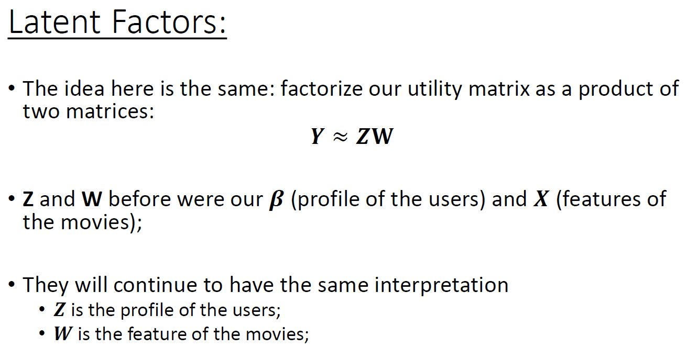
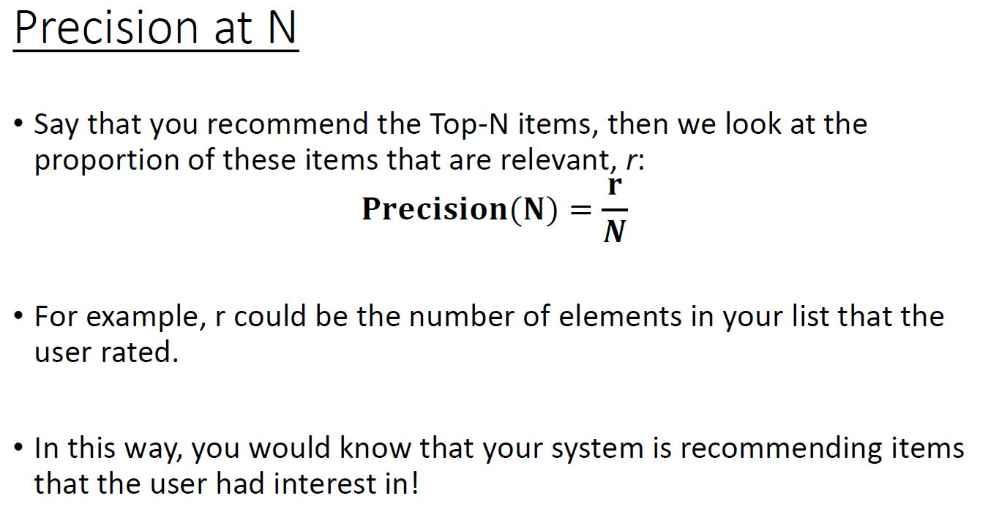

```{r setup, include=FALSE}
knitr::opts_chunk$set(echo = TRUE)
```


Examples of Unsupervised Learning

- Recommendation Systems. 
- Speech Recognition: Cluster different words said in a video and get a subtitle for those words. 
- Grouping Documents. 

[Convex sets](https://en.wikipedia.org/wiki/Convex_set): In Euclidean space, an object is convex if for every pair of points within the object, every point on the straight line segment that joins them is also within the object. 

[This is buzzing around the internet](https://journals.plos.org/ploscompbiol/article?id=10.1371/journal.pcbi.1004228) 


## K-Means

The KMeans algorithm clusters data by trying to separate samples in n groups of equal variance. It scales well to large number of samples and has been used across a large range of application areas in many different fields. 

### Algorithm

1. A choice of k initial centers for the clusters.  
2. Assign each observation to the closest center, $O(ndk)$. 
3. Estimate new centers as _average_ of observations in a cluster, $O(nd)$. 

Repeat 2. and 3. until centers and assignments do not change anymore. Iteration stops when centroids move less than the tolerance. 

- The idea is to minimize the function $J = \sum_{i=1}^k\sum_{j=1}^n u_{ij}||\mathbf{x}_j-\mathbf{v}_i||^2_2$, where $u_{ij}$ is 1 if the point $\mathbf{x}_j$ belongs to cluster $i$, and 0 otherwise; $\mathbf{v}_i$ is the centroid of the $i$th cluster. This is also called inertia, or within-cluster sum-of-squares. 

- Inertia makes the assumption that clusters are convex and isotropic, which is not always the case. It responds poorly to elongated clusters, or manifolds with irregular shapes. 

- In very high-dimensional spaces, Euclidean distances tend to become inflated (this is an instance of the so-called “curse of dimensionality”). Running a dimensionality reduction algorithm such as Principal component analysis (PCA) prior to k-means clustering can alleviate this problem and speed up the computations. 

- But the partition matrix ${\mathbf{U}}=[u]_{ij}$ is discrete, so we cannot use gradients to help us minimize. 

- But why we obtain the centroid? Because the function $f(\mathbf{z})=\sum_{j=1}^n ||\mathbf{x}_j-\mathbf{z}||^2_2$ is minimized at $\mathbf{z}=\mathbf{\bar{x}}$. 

- You might want to change the norm $||\mathbf{x}_j-\mathbf{v}_i||_2$ above with different distance metrics; but then, there is no guarantee that the centroid will minimize the distance being used (it most probably will not!). 

- K-Means can be thought as an approximation of Expectation-Maximization algorithm with a small, all-equal, diagonal covariance matrix. 

- K-Means does not always converge to the same solution but it always converges to a (sub-optimal) solution. The initialization of K-Means is stochastic, therefore, this can affect the results. Should run it several times (see `n_inits` argument). `K-Means++`, which is an initialization strategy solves this problem. 

- K-Means generates convex cluster regions (in fact, the cluster boundaries will be linear). 

- The algorithm supports parameter `sample_weight`. For example, assigning a weight of 2 to a sample record is equivalent to adding a duplicate of that sample to the dataset. 


### K-Means++

- When picking the initial centroids, K-Means++ gives more chance to select points that are far away from centroids already picked. 

- `sklearn.cluster.KMeans` already uses K-Means++ as the default initialization procedure (`init='k-means++'`). 

- Steps: 
  - Choose at random one of the data points to be the first cluster center. 
  - Amongst the remaining points, select one to be a cluster center with probability. 

$$
P(\text{"Select $\mathbf{x}_i$ as cluster center"}) = \frac{\min_{c\in C}d^2(\mathbf{x}_i,\mathbf{c})}{\sum_{j=1}^n\min_{\mathbf{c}\in C}d^2(\mathbf{x_j},\mathbf{c})}
$$

where $C$ is the set of already selected clusters.


### Mini Batch KMeans 

The MiniBatchKMeans is a variant of the KMeans algorithm which uses mini-batches to reduce the computation time, while still attempting to optimise the same objective function. Mini-batches are subsets of the input data, randomly sampled in each training iteration. The quality of the results is reduced marginally. 
  
- In the first step, samples are drawn randomly from the dataset, to form a mini-batch. These are then assigned to the nearest centroid. 

- The assigned centroid is updated by taking the streaming average of the sample and all previous samples assigned to that centroid. This has the effect of decreasing the rate of change for a centroid over time. 


### The Elbow method

- This method looks to the sum of intra-cluster distances. 

- The problem is, we can't just look for a $k$ that minimizes the sum of intra-cluster distance because it decreases as $k$ increases. 

- But we can evaluate the trade-off: "small k" vs "small intra-cluster distances". 

#### Silhouette Distance

The Silhouette method compares the average distance to the corresponding cluster and the average distance to the neighbor cluster to come up with an index $s(i)$ (`sklearn.metrics.silhouette_samples`). 


For each data point $\mathbf{x}_i$ calculate: 

- $\bar{d}({\mathbf{x}}_i, C)$: average distance of $\mathbf{x}_i$ to all other points of cluster $C$ 

- $a(i)=\bar{d}({\mathbf{x}}_i, A)$: where $A$ is the cluster $\mathbf{x}_i$ was assigned to 

- $b(i)=\displaystyle\min_{C\neq A} \bar{d}({\mathbf{x}}_i, C)$: the average distance to the neighbor cluster 

- Silhoute index: $$s(i)=\frac{b(i)-a(i)}{\max\{a(i),b(i)\}}$$ 

  - $s(i)\approx 1$ indicates that the point $\mathbf{x}_i$ is well-assigned in $A$ 
  
  - $s(i)\approx 0$ indicates that it is not clear if the point $\mathbf{x}_i$ should be assigned to $A$ or $B$ (their distances are similar) 
  
  - $s(i)\approx -1$ indicates a possible misclassification, as the point $\mathbf{x}_i$ is, in average, closer to cluster $B$ 

- silhouette measure for each cluster separately: $s_A = \frac{1}{n_A}\sum_{i: x_i\in A}^n s(i)$ for a cluster $A$. 

- Overral index (`sklearn.metrics.silhouette_score`): $s = \frac{1}{n}\sum_{i=1}^n s(i)$. We can use silhouette to select the number of cluster. 

- This can be applied after any clustering algorithm. 


- Note that the silhouette method and elbow method work best if the clusters are spherical. For non-spherical clusters, it can provide misleading results. 


## Distance Metric

Distances metrics are used to measure the dissimilarity between points. The function `scipy.spatial.distance.cdist` is very helpful for calculating distances in python. In R you can use the `stats:dist()` function, or `philentropy::distance` for more options (they have 46 options). 


- **Euclidean distance:** 

$$d(\mathbf{x},\mathbf{y}) =\sqrt{\left(\mathbf{x}-\mathbf{y}\right)^T\left(\mathbf{x}-\mathbf{y}\right)}\\ $$
$$=\sqrt{\sum_{i=1}^d(x_i-y_i)^2}$$

- **Mahalanobis distance:** $$d(\mathbf{x},\mathbf{y})=\sqrt{\left(x_i-y_i\right)^TS^{-1}\left(x_i-y_i\right)}, $$ 
where $\mathbf{S}$ is the sample covariance matrix 

  - more generally, we can replace_ $\mathbf{S}$ _with any positive definite matrix_ $\mathbf{A}$) 

> [Wiki](https://en.wikipedia.org/wiki/Mahalanobis_distance)
  The Mahalanobis distance is a measure of the distance between a point P and a distribution D, introduced by P. C. Mahalanobis in 1936.[1] It is a multi-dimensional generalization of the idea of measuring how many standard deviations away P is from the mean of D. This distance is zero if P is at the mean of D, and grows as P moves away from the mean along each principal component axis. If each of these axes is re-scaled to have unit variance, then the Mahalanobis distance corresponds to standard Euclidean distance in the transformed space.  


- **Minkowski distance:** $$d_p(\mathbf{x},\mathbf{y}) = \left(\displaystyle\sum_{i=1}^d\left|x_i-y_i\right|^{p}\right)^{1/p}, \quad p\geq 1$$

source:https://helloacm.com/how-to-compute-minkowski-euclidean-and-cityblock-distance-in-c/


## DBSCAN

*DBSCAN*: Density-Based Spatial Clustering of Applications with Noise. Finds core samples of high density and expands clusters from them. Good for data which contains clusters of similar density. 

The idea is that, inside the clusters we have higher density of points than outsides the clusters. To be part of a cluster, each point must have at least `min_samples` neighbors in a given radius (`eps`). The neighborhood shape will be defined by the distance metric used. 

**Core points** are points that have at least `min_samples` points in the neighborhood.  

**Border points** Border points are points with fewer than `min_samples` points in the neighborhood, but are connected to a core point. They don't spread the color they only recieve the color from core points.  

**noise point** if a point is not neighbor of a core point); in this case it will be labeled as noise (sklearn.cluster.DBSCAN uses `-1` for noise). 


### Algorithm

- Pick a point $p$ to start with.

- If $p$ is a core point, give it a color (label). 

- Spread the color of $p$ to all of its neighbors.
  - core points are contagious;

- Check if any of the neighbors that received the color is a core point, if yes, spread the color to its neighbors as well, esle don't spread the color. 

- Once there're no more neighbors core points left to spread the color, pick a new unlabeled point `p'` and repeat the process.


**Question:** Does the order that you pick the points matter in DBSCAN?  

> No. Any of the cluster's core points is able to fully identify the cluster, with no randomness involved. The only possible conflict you might get is that if two clusters have the same border point. In this case the assignment will be implementation dependent, but usually the border point will be assigned to the first cluster that "finds" it. 


If 2 core points are initialized on the same actual cluster then DBSCAN will treat it as a mix to 2 components in which case the clustering will depend on initialization. 

If the density of 2 clusters are very different then DBSCAN will not be able to correcty identify clusters because `min_samples` along with `eps` define the minimum density of a clusters. 


## Hierarchical Clustering

**Idea:** In a step-by-step way, merge (or divide) the existing clusters; 

Unfortunately, `sklearn` does not support dendrogram. For hierarchical clustering, the package.  [scipy.cluster.hierarchy](https://docs.scipy.org/doc/scipy/reference/cluster.hierarchy.html) is helpful. 


### Ward's Hierarchical Clustering 

- So far we have been merging clusters based on distance. 
- Ward's Hierarchical Clustering Method merges clusters based on the inertia. 
- In this way, we merge the two clusters that will cause the minimum increase in the inertia. 


### Agglomerative Clustering

Agglomerative clustering works by merging clusters;

The overall idea is: 

- Start with each point as a separate cluster. 
- Merge the clusters that are most similar to each other. 
- Repeat Step 2 until you obtain only one cluster. 


### How to measure clusters' dissimilarity?

Some strategies: This effects the way a point is merged with a cluster. Single linkage will consume the point quickly. 

- Minimum distance (Single Linkage): The distance between a point `p` and a cluster is the minimum distance of the point `p` with every point in the cluster. Different distance metrics that provide the same orderings will not affect single linkages. 
- Maximum distance (Complete Linkage): Similar to Single Linkage but instead of `min()` we use `max()`. 
- Average distance (Average Linkage): Similar to Single Linkage but instead of `min()` we use `mean()`. Changes in the distance metrics may affect the Average linkage, even if it doesn't change the ordering. 


Understanding the output of `linkage`  

- The function `linkage` will return a matrix (n-1)x4: 
  - First and second columns: indexes of the clusters being merged. 
  - Third column: the distance between the clusters begin merged. 
  - Fourth column: the number of elements in the newly formed cluster. 
- The rows represent the iterations. 
- The output matrix from the `linkage` function might be of little use other than for the dendrogram. 
- To bring the clustering to a "flat" format, we can use `fcluster(output_linkage, n_cluster, criterion='maxclust')` 


## Principal Component Analysis

Forgot to add PCs has to pass through origin after standardizing (centering & scaling). 


By minimizing the sum of orthogonal distance we are maximizing the variance in $Z_1$ direction. Since when orthogonal distance is minimum, other 2 sides of a right angle traingle becomes almost similar in length so basically $Z_1$ is the best approximation of the sum of squared distances of each data point from its centroid or origin. That is why it is a good idea to maximize variance.   

- If the number of dimensions $d$ is higher than the number of data points $n$, we get problems even with simple models like linear regression. For example, image that we collected the 14 wine features for only 10 wines. 
- In this situations, we would need some strategies here, such as regularization, or **dimensionality reduction** as a preprocessing step. 


Let $Z$ be our new desired representation.

$$
\textbf{Z}_{(n\times k)} = \textbf{X}_{(n\times d)}\left(\textbf{w}_{(k\times d)}\right)^T
$$

where $1\leq k \leq d$ and $d$ is the dimension of the original dataset. 

Or, if you prefer, the $j$-th new feature of $i$-th individual is 

$$
Z_{ij} = \textbf{x}_i^T\textbf{w}_{j} = w_{j1}x_{i1} + w_{j2}x_{i2} +\ldots + w_{jd}x_{id}
$$


- $V$ the inverse transformation of $Z$ to recover $X$ from $Z$, with $n$ rows and $d$ features. It is like bringing $Z$ back to the $X$ space. 

- $V$ will possibly be different from $X$; $X_{(n\times d)} \approx V_{(n\times d)}=Z_{(n\times k)}W_{(k\times d)}$. If $k=d$, then the $\approx$ becomes $=$ (i.e., you can precisely recover $X$). 


- We have that $\sum_{j=1}^dVar(X_j)=\sum_{j=1}^dVar(Z_j)$. So now we can measure how much of the variance each component is capturing: This will help us to identify how many components to use. 

- If we choose components less than the original dimensions then we loose some information. If we use same number of dimensions $k=d$ then there will no information loss. 


- The principal components are pairwise uncorrelated. To see that consider 

$$
Cov(Z_1,Z_2) = Cov(Xw_1,Xw_2) = w_1^TCov(X,X)w_2 = w_1^T\Sigma w_2
$$


$$
\lambda_2 w_1^T w_2 = ||w_1||*||w_2||*\cos(\theta) = 0
$$
since $w_1$ and $w_2$ are orthogonal ($\theta=90^o$). 


### The loss function: 

- We've seen that PCA obtains orthogonal directions of maximum variances 
- An alternative way to derive PCA is to minimize the reconstruction error:
$$
L(\mathbf{Z},\mathbf{W})=||\mathbf{Z}\mathbf{W} - \mathbf{X}||^2_F
$$
- Where $||.||_F$ stands for [Frobernius Norm](https://mathworld.wolfram.com/FrobeniusNorm.html) which is the same as: ```np.sum((Z @ W - X)**2)``` 


- Searching for the line/plane/hyperplane that minimizes the reconstruction error:

 $$
(Z^*, W^*) = \text{arg min}_{Z,W} \sum_{i=1}^n ||x_i - Z_iW||^2_2 \quad \text{ s.t.}\quad WW^T=I
 $$
 where $x_i$ and $Z_i$ are the $i$-th row of $X$ and $Z$, respectively. 


**Multicolinearity and PCA** 

- In there is multicollinearity in the data that means the correlated variables can be represented in the form of others. Meaning that data can be represented in a lower dimensional subspace. 
- When we transfrom this data using PCA to the same space as original data ($d$ dimensions) we get some later PCs whose variance will be really less. These PCA have close to $0$ variance because these are the extra dimensions of the data. Rest other PCs are orthogonal and don't hace correlations between them. 

**Outliers** 

- PCA may maintain the outlier after the transformation or not. Finding PCs could be a little biased because of outliers in the original data. 


### Sparse PCA 

- One problem with PCA is that the components are dependent on all the features, which makes them very hard to interpret. Shape of $w$ is $k\times d$. 
- A Sparse PCA reduces the number of variables used in each component, by making some (or many) of the $w_{ij}$ equal zero; 

- The Sparse PCA changes this objective functions in two ways: 
  1. it adds an $L_1$ regularizer; 
  2. it changes the constraint $WW^T=1$  to $||W_j||_2=1, \forall j$ 
    
$$    
    (Z^*, W^*) = \text{arg min}_{Z,W} \sum_{i=1}^n ||x_i - Z_iW||^2_2 + \alpha||W||_1 \quad \text{ s.t.}\quad ||Z_j||_2=1, \ \  j=1,...,k
$$

- Modification of the restriction makes us lose the orthogonality property; It comes with a cost: it is more computationally intensive; 

(There are actually many versions of Sparse PCA which might slightly change the restriction and/or the regularization)


### Non-negative Matrix Factorization 

Published in [Nature](http://www.cs.columbia.edu/~blei/fogm/2018F/materials/LeeSeung1999.pdf) `sklearn.decomposition.NMF` 

- In PCA we require that our components, matrix $W$ is orthonormal;

- In vector quantization (K-Means) we did a similar decomposition: $$X_{(n\times d)} \approx Z_{(n\times k)}W_{(k\times d)}$$ where each row of $Z$ has one element equals to one and the other are zero, indicating the cluster of that row. 

- MNF uses simila strategy but different constraints imposed on $Z$ and $W$; In NMF, both $Z$ and $W$ will be allowed to contain only non-negative values; 

- Because with the non-negativity of the elements, the NMF "components" will be only adding things; Once something is added it cannot be removed because we cannot subtract anything. For e.g., in PCA you can have something like: $Z_1 = 2X_1 - 3X_2$, a cancellation effect from subtraction; In NMF, once you added $2X_1$ to the component $Z_1$ it cannot be cancelled out; 
  - For e.g, in a face you might have different mouths, noses, etc...that you add to form a face; 

- It is naturally more sparse than PCA; 

- It depends on the initialization; Changing the number of components actually changes the directions of the other components; 
  - Differently from PCA, where you could remove components after the learning; 


## Recommendation System


 

 

 

 

 

 

 

 

 

 

 

 

 

 

 

 

 

 

 

 

 


