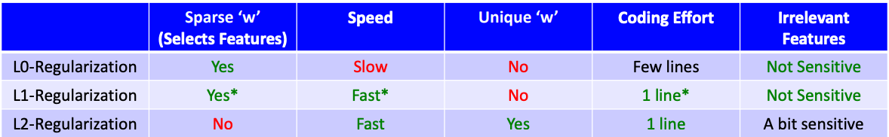

```{r setup, include=FALSE}
knitr::opts_chunk$set(echo = TRUE)
```


## Regularization 

- When we regularize our estimates we are making out estimates a little biased towards 0, when the loss function is optimizaed to give lowest possible error we get a lower variance because of the fundamental trade-off. 
- Why to shrink weights: 
  - In linear models, the rate of change of the prediction function is proportional to the individual weights. 
  - So if we want the function to change slowly, we want to ensure that the weights stay small. 
- If n_samples < n_features regularization tends to help 
- As training data size increases, the effect of regularization goes down. 

**How to pick $\lambda$?:** 

- Theory: as $n$ grows $\lambda$ should be in the range $O(1)$ to $\sqrt{n}$. 
- Practice: optimize validation set or cross-validation error. 


```{python Norms, eval=FALSE}
# norms of a vector
from numpy import array
from numpy.linalg import norm
w = array([1, -2, 3, 0])
# l0 norm is the number of non-zero values in a vector
print("The l0 norm of %s is: %0.3f"%(w,norm(w, 0)))

# l1 norm is the sum of the absolute values in a vector.
print("The l1 norm of %s is: %0.3f"%(w,norm(w, 1)))

# l2 norm is square root of the sum of the squared values in a vector.
print("The l2 norm of %s is: %0.3f"%(w,norm(w, 2)))
```


### L0 regularization 

- L0 "norm" $\lVert w \rVert \rightarrow$ the number of non-zero elements in $w$. This function called step function is a discontinous & non-differentiable function which makes continous optimization techniques useless. 

$$ score(S) = \frac{1}{2}\lVert{Xw -y}\rVert^2 + \lambda \lVert w\rVert_0$$

### L2 regularization 

- `sklearn.linear_model.Ridge`: Ridge regression addresses some of the problems of Ordinary Least Squares by imposing a penalty on the size of the coefficients with l2 regularization. 

- `class sklearn.linear_model.Ridge(alpha=1.0, fit_intercept=True, normalize=False, copy_X=True, max_iter=None, tol=0.001, solver='auto', random_state=None)` 

- Standard regularization strategy is L2-regularization 
    - $\lambda \rightarrow$ regularization strength 
    - $\lVert w\rVert_2^2 \rightarrow$  $L2$ norm of $w$ 
        - square root of the sum of the squared weight values. 

$$f(w) = \frac{1}{2}\sum_i^n(w^TX_i - y_i)^2 + \frac{\lambda}{2}\sum_j^d w_j^2 \text{ or }$$ 
$$f(w) = \frac{1}{2}\lVert Xw - y\rVert_2^2 + \frac{\lambda}{2} \lVert w\rVert_2^2$$

- Balances getting low error vs. having small slopes $w_j$ 
- In terms of fundamental trade-off: 
  - You can increase the training error if it makes $w$ much smaller. 
  - Nearly-always reduces overfitting. 
- Penalizing $w_j^2$ means different things if features $j$ are on different scales. So Scaling is important in this case. 
- $\lVert Xw - y\rVert^2$ increases with $\lambda$, and $\lVert w\rVert^2$ decreases with λ. 
  - Though individual $w_j$ can increase or decrease with lambda because we use the L2-norm, the large ones decrease the most. 

> **Should we regularize the y-intercept?** 

- No!: Why encourage it to be closer to zero? (It could be anywhere.). You should be allowed to shift function up/down globally. 
- Yes!: It makes the solution unique and it easier to compute $w$. 
- Compromise: regularize by a smaller amount than other variables. 
  - $f(w) = \lVert Xw + w_0 - y\rVert^2 + \frac{\lambda}{2}\lVert w\rVert^2 + \frac{\lambda}{2}w_0^2$ 

> **Some properties of L2 regularization** 

- Solution $w$ is unique and fast. 
- Almost always improves the validation error. 
- No collinearity issues. 
- Less sensitive to changes in $X$ or $y$. 
- Gradient descent converges faster (bigger $\lambda$ means fewer iterations). 
- Worst case: just set $\lambda$ small and get the same performance. 


### L1 regularization 

- `sklearn.linear_model.Lasso`: The Lasso is a linear model that estimates sparse coefficients with l1 regularization. We say a linear function is sparse if most of the coefficients are zero. Shrinks the coefficients to actual zeros. 
- L1-Regularization isn't as sparse as L0-regularization. L1-regularization tends to give more false positives (selects too many). 
- `class sklearn.linear_model.Lasso(alpha=1.0, fit_intercept=True, normalize=False, precompute=False, copy_X=True, max_iter=1000, tol=0.0001, warm_start=False, positive=False, random_state=None, selection='cyclic')` 
- L1 norm $\lVert w \rVert_1 = \lvert w_1 \rvert + \lvert w_2 \rvert + \dots + \lvert w_n \rvert$ 

$$f(w) = \frac{1}{2}\lVert Xw - y\rVert_2^2 + \frac{\lambda}{2} \lVert w\rVert_1$$


### Elastic nets

- `sklearn.linear_model.ElasticNet`: Combine good properties from both worlds 
- `class sklearn.linear_model.ElasticNet(alpha=1.0, l1_ratio=0.5, fit_intercept=True, normalize=False, precompute=False, max_iter=1000, copy_X=True, tol=0.0001, warm_start=False, positive=False, random_state=None, selection='cyclic')` 

$$f(w) = \frac{1}{2}\lVert Xw - y\rVert_2^2 + \lambda(\alpha\lVert w\rVert_1 + (1-\alpha)\lVert w\rVert_2^2 )  $$

- $\lambda$ control the strength of regularization 
- $\alpha$ controls the amount of sparsity and smoothness 
- L1 promotes sparsity and the L2 promotes smoothness. 
- The functional is strictly convex: the solution is unique. 
- No collinearity problem 
  - A whole group of correlated variables is selected rather than just one variable in the group. 





