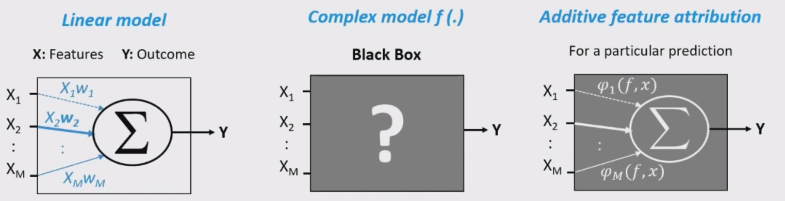
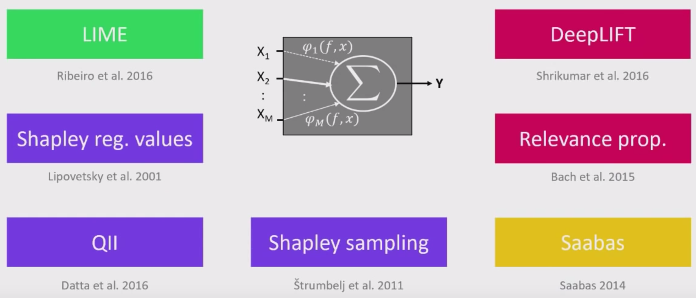

Supervised Learning II Notes
================
Shivam Verma
20/01/2020

  - [Feature Selection](#feature-selection)
      - [Association Based Approaches (one example is
        correlation)](#association-based-approaches-one-example-is-correlation)
      - [Search and score methods](#search-and-score-methods)
  - [Performance Metrics](#performance-metrics)
  - [Dealing with data imbalance, model
    explainers](#dealing-with-data-imbalance-model-explainers)
      - [Approaches to handle Class
        Imbalance](#approaches-to-handle-class-imbalance)
      - [Stratified Sampling](#stratified-sampling)
  - [Model
        Interpretability](#model-interpretability)
      - [[eli5](https://eli5.readthedocs.io/en/latest/tutorials/black-box-text-classifiers.html#lime-tutorial)](#eli5)
      - [[SHAP](https://github.com/vermashivam679/shap)](#shap)

## Feature Selection


### Association Based Approaches (one example is correlation)

#### Feature ranking with Recursive Feature Elimination.

  - [sklearn.feature\_selection.RFE](https://scikit-learn.org/stable/modules/generated/sklearn.feature_selection.RFE.html#sklearn.feature_selection.RFE)
    (`sklearn.feature_selection.RFE(estimator,
    n_features_to_select=None, step=1, verbose=0)`)
  - [Cross Validated
    RFE](https://scikit-learn.org/stable/modules/generated/sklearn.feature_selection.RFECV.html#sklearn.feature_selection.RFECV)(`sklearn.feature_selection.RFECV(estimator,
    step=1, min_features_to_select=1, cv=None, scoring=None, verbose=0,
    n_jobs=None)`)  
  - Given an external estimator that assigns weights to features (e.g.,
    the coefficients of a linear model), the goal of recursive feature
    elimination (RFE) is to select features by recursively considering
    smaller and smaller sets of features.  
  - First, the estimator is trained on the initial set of features and
    the importance of each feature is obtained either through a `coef_`
    attribute or through a `feature_importances_` attribute.  
  - Then, the least important features are pruned from current set of
    features. That procedure is recursively repeated on the pruned set
    until the desired number of features to select is eventually
    reached.  
  - Allows NaN/Inf in the input if the underlying estimator does as
    well.

<!-- end list -->

``` python
estimator = SVR(kernel="linear")
selector = RFE(estimator, 5, step=1)
selector = selector.fit(X, y)
selector.support_
selector.ranking_
```

### Search and score methods

  - Most common feature selection framework
      - Define a **scoring function**
        ")
        that measures the quality of the set of features
        .  
      - Now **search** for the set of features
         with the best
        score.  
      - Return  with the
        best score(lowest validation error).  
  - Problems
      - If there are 
        features, there are
        
        combinations to search.  
      - Optimization bias is high: we are optimizing over
        
        models\!  
      - Prone to false positives: Irrelevant variables sometimes help by
        chance.

A scoring function in score and search methods can be written as
follows.   
 = \\frac{1}{2}\\lVert{Xw -y}\\rVert^2 + \\lambda \\lVert w\\rVert_0")  

  - Here smaller  means we remove most of the features.
      - **Smaller  means we do not use many features.**  
  - And larger
     means aggressive feature selection.
      - **A larger
         means, we are forcing most of the weights to be 0
        and so aggressive feature selection.**
  - Hard to “search” because the search space is large.
      - 
        combinations to search if
         is the number
        of features  
  - So instead of exhaustively searching for this space, we go with
    greedy
approaches.

#### Forward selection(Greedy approach, not implemented in `sklearn`): Pseudo code

  - Given  and
      
  - Start with an empty set of features   
  - Initialize the score (e.g., score =
    ,
    if score is validation error)  
  - For each possible feature 
      - Compute the scores of features in
         combined with
          
  - If no 
    improves the score, stop.  
  - Otherwise add feature
     to
     which improves the
    score the most, update the score, and go back to step 2.  
  - Not guaranteed to find the best feature set but reduces many
    problems
      - Cheaper (considers only
        ") models compared to
        ") models).  
      - Overfits less (less optimization bias).  
      - Reduces false positives (smaller chance of irrelevant variables
        helping by chance).

> There are some other types of stochastic search methods that inject
> randomness so that we can explore new parts of the search space.
> Example- Simulated annealing, Genetic algorithms, etc.

#### Warnings about feature selection

  - A feature is only relevant in the context of other features.
      - Adding/removing features can make features
        relevant/irrelevant.  
  - Confounding factors can make irrelevant features the most
    relevant.  
  - If features can be predicted from other features, you cannot know
    which one to pick(Conditional independence).  
  - Relevance for features does not have a causal relationship.

#### General advice on finding relevant features

  - Try the association approach  
  - Try forward selection with different values of
      
  - Try other feature selection methods (e.g., `RFE`, simulated
    annealing, genetic algorithms)  
  - Talk to domain experts; they probably have an idea why certain
    features are relevant.

## Performance Metrics

  - [Awesome ROC
    Animations](https://github.com/dariyasydykova/open_projects/tree/master/ROC_animation)
  - AUC tells us the area under an ROC curve, and, generally, an AUC
    value over 0.7 is indicative of a model that can distinguish between
    the two outcomes well. An AUC of 0.5 tells us that the model is a
    random classifier, and it cannot distinguish between the two
    outcomes. The shape of an ROC curve changes when a model changes the
    way it classifies the two outcomes.  
  - Precision-recall curve also displays how well a model can classify
    binary outcomes. Similarly to the ROC curve, when the two outcomes
    separate, precision-recall curve will approach the top-right corner.
    Typically, a model that produces a precision-recall curve that is
    closer to the top-right corner is better than a model that produces
    a precision-recall curve that is skewed towards the bottom of the
    plot.  
  - Precision-recall curve is more sensitive to class imbalanace than an
    ROC curve. ROC curve tends to be more robust to class imbalanace
    that a precision-recall curve.  
  - When the standard deviation of one of the outcomes changes, an ROC
    curve and its AUC value also change.  
  - It might indicate that the model performance has increased, when, in
    fact, the prediction performance has worsened for e.g. at small
    false positive rates.  
  - My Understanding of the ROC curve: In a perfect model:
      - When everything is classified as 1 (the probability threshold is
        0) then TPR is 1 & FPR is also 1.  
      - When we increase the threshold then TPR stays at 1 & FPR
        decreases.  
      - At a point when TPR is still 1 & FPR becomes 0 then we are
        classifying exactly the same number of 1s as the data has.  
      - Beyond that point FPR stays at 0 & TPR decreases until we are
        classifying no 1s & TPR also becomes 0.  
      - This describes a perfect shape of the ROC curve. For an
        imperfect model the shape is distorted but is similar to ideal
        shape.

## Dealing with data imbalance, model explainers

``` python
X_adult,y_adult = shap.datasets.adult()
X_adult_display,y_adult_display = shap.datasets.adult(display=True)
X_adult_train, X_adult_test, y_adult_train, y_adult_test = train_test_split(X_adult, y_adult, test_size = 0.2, random_state = 111)
X_adult_display.head(5)
```

### Approaches to handle Class Imbalance

  - `class_weight` (dict, ‘balanced’ or None) parameter of many scikit
    learn algorithms is used to provide weights associated with classes
    in the form `{class_label: weight}`. If not given, all classes are
    supposed to have weight one.
    
      - This was equivalent to saying “repeat every positive example
        `weight` number of times in the training set”.
      - `class_weight="balanced"`: This sets the weights so that the
        classes are “equal”. The “balanced” mode uses the values of y to
        automatically adjust weights inversely proportional to class
        frequencies in the input data as n\_samples / (n\_classes \*
        np.bincount(y)).
      - `sklearn.utils.class_weight.compute_class_weight('balanced',
        classes, y)`: This can be used to calculate weights used by
        sklearn using the balanced method.
      - changing the class weight will **generally reduce accuracy**.
        The original model was trying to maximize accuracy.

  - **Undersampling**: Take a random sample from the majority class of
    size equal to the minority class.
    
      - This is generally not considered a good approach.

  - **Random oversampling of the minority class with replacement**

  - **SMOTE (Synthetic Minority Over-sampling Technique)**
    
      - Create “synthetic” examples rather than by over-sampling with
        replacement.
      - The minority class is over-sampled by taking each minority class
        sample and introducing synthetic examples along the line
        segments joining any/all of the
         minority class
        nearest neighbors.
      -  is chosen
        depending upon the amount of over-sampling required.
      - Take the difference between the feature vector (sample) under
        consideration and its nearest neighbor.
      - Multiply this difference by a random number between 0 and 1, and
        add it to the feature vector under consideration.
      - This causes the selection of a random point along the line
        segment between two specific features.
      - This approach effectively forces the decision region of the
        minority class to become more general.

<!-- end list -->

``` python
# Let's try to create samples using SMOTE
sm = SMOTE(random_state=42)
X_train_sm, y_train_sm = sm.fit_resample(X_train, y_train)
smote_model = LogisticRegression(solver = 'liblinear', max_iter=500)
smote_model.fit(X_train_sm, y_train_sm);

### sklearn Pipeline won't work here
### So let's use imblearn.pipeline
from imblearn.pipeline import Pipeline
pipe = Pipeline(steps=[('smote', SMOTE()),
                       ('classifier', LogisticRegression(solver = 'liblinear', max_iter=500))])
weights = np.linspace(0.05, 0.95, 20)
param_grid={
    'smote__sampling_strategy': weights
}

gs = GridSearchCV(estimator=pipe,  
                  param_grid = param_grid, 
                  scoring='f1',
                  cv=5,
                  return_train_score = True
                 )
gs.fit(X_train, y_train);
```

### Stratified Sampling

  - A similar idea of “balancing” classes can be applied to data
    splits.
  - [`StratifiedKFold`](https://scikit-learn.org/stable/modules/generated/sklearn.model_selection.StratifiedKFold.html):
    This cross-validation object is a variation of KFold that returns
    stratified folds. The folds are made by preserving the percentage of
    samples for each class.
  - For e.g. if we have 10% negative examples in total, then each fold
    will have 10% negative examples.
  - We have the same option in `train_test_split` with the `stratify`
    argument.
  - Since its no longer a random sample, probably theoretically bad, but
    not that big of a deal.
  - It can be especially useful in multi-class, say if you have one
    class with very few
cases.

## Model Interpretability

### [eli5](https://eli5.readthedocs.io/en/latest/tutorials/black-box-text-classifiers.html#lime-tutorial)

ELI5 is a Python library which allows to visualize and debug various
Machine Learning models using unified API. It has built-in support for
several ML frameworks and provides a way to explain black-box models.

``` python
X,y = shap.datasets.adult()
X_display,y_display = shap.datasets.adult(display=True)

### How to look at weights if you have transformed the data
marital_status_feature = ['Marital Status']
other_features = ['Age', 'Workclass', 'Education-Num', 'Occupation',
       'Relationship', 'Race', 'Sex', 'Capital Gain', 'Capital Loss',
       'Hours per week', 'Country']

marital_status_transformer = Pipeline(steps=[
                                          ('onehot', OneHotEncoder(sparse=False, handle_unknown='ignore'))
                                         ])

preprocessor = ColumnTransformer(
                                 transformers=[
                                    ('marital', marital_status_transformer, marital_status_feature),
                                    ('other', "passthrough", other_features)
                                ])

xgb = XGBClassifier()
xgb_ppl = Pipeline(steps=[('preprocessor', preprocessor),
                      ('classifier', xgb)])
xgb_ppl.fit(X, y);
ohe_features = xgb_ppl['preprocessor'].transformers_[0][1]['onehot'].get_feature_names(marital_status_feature)
all_features = other_features + list(ohe_features)

eli5.explain_weights(xgb_ppl['classifier'], feature_names = all_features)
```

### [SHAP](https://github.com/vermashivam679/shap)






  - Calculates **SHAP** values, which are rooted in game theory, as a
    unified measure of feature importance.
  - *Provides following kind of explanation*: Start at a base rate
    (e.g., how often people get their loans rejected). Add one feature
    at a time and see how it impacts the decision.
  - The order of the features we consider matters\!
  - In cooperative games find each player’s marginal contribution,
    averaged over every possible sequence in which the players could
    have been added to the group.
  - Computationally challenging, SHAP provides an efficient way to deal
    with this.

Provides explainer for different kinds of models

  - [TreeExplainer](https://shap.readthedocs.io/en/latest/) (supports
    XGBoost, CatBoost,
    LightGBM)
  - [DeepExplainer](https://shap.readthedocs.io/en/latest/index.html#shap.DeepExplainer)
    (supports deep-learning
    models)
  - [KernelExplainer](https://shap.readthedocs.io/en/latest/index.html#shap.KernelExplainer)
    (supports kernel-based
    models)
  - [GradientExplainer](https://shap.readthedocs.io/en/latest/index.html#shap.GradientExplainer)
    (supports Keras and Tensorflow models)
