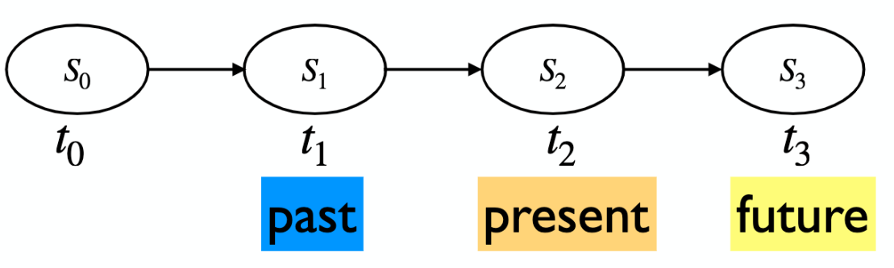
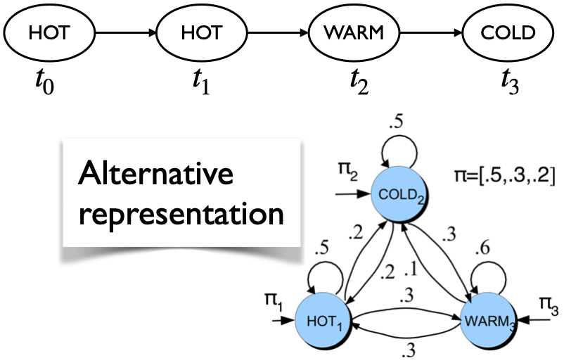

```{python setup, include=FALSE}
import pandas as pd
import numpy as np
```


### Language models

- Compute the probability of a sentence or a sequence of words: $P(w_1, w_2,\dots,w_t)$
- A related task: What's the probability of an upcoming word? $P(w_t|w_1,w_2,\dots,w_{t-1})$ 
  - Example: Your smartphone's or Gmail's feature of next word(s) suggestion 

A model that computes either of these probabilities is called a _language model_. 

Language models helps in: 

- **Machine translation**: P(In the age of data algorithms have the answer) > P(the age data of in algorithms answer the have) 
- **Spelling correction**: P(10 <span style="color:blue">minute</span> bus ride from my home) > P(10 <span style="color:red">minuet</span> bus ride from my home) 
- **Speech recognition**: P(<span style="color:blue">I read</span> a book) > P(<span style="color:red">Eye red</span> a book) 


## Markov chains 

### Applications 

- **Predict probabilities of sequences of states** 
- **Inference**: compute probability of being in a particular state at time $t$. 
- **Stationary distribution**: Find the steady state after running for a long time. 
  - Markov studied the sequence of 20,000 letters in A. S. Pushkin's poem Eugeny Onegin and gave the stationary distribution for vowels and consonants. 
  - Markov also studied the sequence of 100,000 letters in S. T. Aksakov's novel "The Childhood of Bagrov, the Grandson" (tedious calculation) and gave the stationary distribution for vowels and consonants. 
- **Generation**: generate sequences that follow the probabilities of the states. 
- **Decoding**: compute most likely sequences of states 

### Idea and applications 

- Often we need to make inferences about evolving environments. 
- Represent the state of the world at each specific point via a series of snapshots or time slices. 
- Predict future depending upon 
  - what the current state is and 
  - the probability of change 

- Examples: 
  - Weather: Given that today is cold, what will be the weather tomorrow? 
  - Stock prices: Given the current market conditions what will be the stock prices tomorrow? 


### Assumption

 

**Markov assumption: The future is conditionally independent of the past given present**

- In the example above 

$$P(S_{3}|S_0, S_1, S_2) \approx P(S_{3} | S_2)$$

- Generalizing it to $t$ time steps 

$$P(S_{t+1}|S_0, \dots, S_t) \approx P(S_{t+1} | S_t)$$


**Example**

 

- **State space**: Represent the unique observations in the world. We have a finite set of possible states we can be in at time $t$. We have discrete timesteps: $t = 0, t = 1, \dots$. We can be in only one state at a given time. Here $S = \{HOT, COLD, WARM\}$. 

- **Initial discrete probability distribution over states**: The probability of starting with a particular state. 
  - $\pi_0 = \begin{bmatrix} P(\text{HOT at time 0}) & P(\text{COLD at time 0}) & P(\text{WARM at time 0}) \end{bmatrix} = \begin{bmatrix} 0.5 & 0.3 & 0.2 \end{bmatrix}$ 

- **Transition probability matrix** $T$, where each $a_{ij}$ represents the probability of moving from state $s_i$ to state $s_j$, such that $\sum_{j=1}^{n} a_{ij} = 1, \forall i$ 

$$ T = 
\begin{bmatrix}
\text{P(HOT|HOT)} & \text{P(COLD|HOT)} & \text{P(WARM|HOT)}\\
\text{P(HOT|COLD)} & \text{P(COLD|COLD)} & \text{P(WARM|COLD)}\\
\text{P(HOT|WARM)} & \text{P(COLD|WARM)} & \text{P(WARM|WARM)}\\
\end{bmatrix}
=
\begin{bmatrix}
0.5 & 0.2 & 0.3\\
0.2 & 0.5 & 0.3\\
0.3 & 0.1 & 0.6\\    
\end{bmatrix}
$$


**Homogeneous Markov chains**: Transition probabilities are the same for all $t$. 


- **Predict probabilities of sequences of states**: Probability of the sequences: HOT, HOT, WARM, COLD

$$\begin{equation}
\begin{split}
P(\textrm{HOT, HOT, WARM, COLD}) =& P(\textrm{HOT}) \times P(\textrm{HOT|HOT})\\ 
                                  & \times P(\textrm{WARM|HOT})\\
                                  & \times P(\textrm{COLD|WARM})\\
                                 =& 0.5  \times 0.5 \times 0.3 \times 0.1\\
\end{split}
\end{equation}$$


- **Inference**: Probability of being in a particular state at time $t$, $\pi_t = \pi_{t-1} \times T$ 
  - Applying the matrix multiplication to the current state probabilities does an update to the state probabilities! 


- **Stationary distribution**: A stationary distribution of a Markov chain is a probability distribution over states that remains unchanged in the Markov chain as time progresses.
  - A probability distribution $\pi$ on states $S$ is stationary where the following holds for the transition matrix: $\pi T=\pi$ 
  - **Conditions for stationary distribution** 
    - *Sufficient condition for existence/uniqueness* is positive transitions: $P(s_t | s_{t-1}) > 0$ 
    - *Weaker sufficient conditions for existence/uniqueness* 
      - **Irreducible**: A Markov chain is irreducible if it is possible to get to any state from any state. It does not get stuck in part of the graph. 
      - **Aperiodic**: Loosely, a Markov chain is aperiodic if it does not keep repeating the same sequence. Check [this](https://en.wikipedia.org/wiki/Markov_chain#Periodicity) if you  want to know the formal definition. 


### Learning Markov chains

- By counting, similar to naive Bayes. Given $n$ samples, MLE for homogeneous Markov chain is: 
  - Initial: $P(s_i) = \frac{\text{number of times we start in } s_i}{n}$ 
  - Transition: $P(s_j|s_{i}) = \frac{\text{number of times we moved from } s_{i} \text{ to } s_j}{\text{number of times we moved from } s_{i} \text{ to } anything}$ 

- Suppose you want to learn a Markov chain for words in a corpus of $n$ documents. 
  - The initial probability distribution $\pi_0$: For all states (unique words) $w_i$, compute $\frac{\text{number of times a document starts in } w_i}{n}$ 
  - Calculate the transition probabilities for all state combinations $w_i$ and $w_j$: $\frac{\text{number of times } w_i \text{ is followed by } w_j}{\text{number of times } w_i \text{ is followed by anything}}$ 


### Ngram language models using Markov Chains

- Bad Model: just count occurrences to get conditional probabilities. The counts will be tiny and the model will be very sparse. 

$$
P(\textrm{In the age of data algorithms have the answer}) = P(\textrm{In}) \times P(\textrm{the|In})
                                               \times P(\textrm{age|In the}) \times P(\textrm{of|In the age})
                                               \times P(\textrm{data|In the age of})
                                               \times P(\textrm{algorithms|In the age of data}) 
                                                \times P(\textrm{have|In the age of data algorithms}) 
                                               \dots 
$$

- Bigram language model: We assume $P(\textrm{algorithms|In the age of data}) \approx P(\textrm{algorithms|data})$ 

$$P(\textrm{In the age of data algorithms have the answer}) = P(\textrm{In}) \times P(\textrm{the|In}) 
                                               \times P(\textrm{age|the})
                                               \times P(\textrm{of|age})
                                               \times P(\textrm{data|of})
                                               \times P(\textrm{algorithms|data})                  
                                               \times P(\textrm{have|algorithms})                              
                                               \times P(\textrm{the|have})                                    
                                               \times P(\textrm{answer|the})               
$$

- Trigram language model: Consider this corpus = {a rose is a rose}, Vocabulary size: $V = 3$ 
  - Word trigram model of language (n = 2) 
    - Each state consists of a sequence of two words (bigrams) from the vocabulary. 
    - State space = {(a a), (a rose), (a is), (rose a), (rose rose), (rose is), (is a), (is rose), (is is)} ($3^2$ states). Many of these might not occur in the corpus. 
    - Markov assumption: $P(s_{t+1}|s_0, \dots s_t) = P(s_{t+1}|s_t)$ 
    - $P(\text{(a rose)|(a rose), (rose is), (is a)}) = P(\text{(a rose)}|\text{(is a)})$ 
    - What transitions are possible? 


**Some Disadvantages of n-gram models** 

- In many cases, we can get by with ngram models. But in general, it is not a good assumption that the next word that I utter will be dependent on the last $n$ words? For e.g. *The computer I was talking about yesterday when we were having dinner crashed*. Language has long-distance dependencies. 
- We can extend it to $3$-grams, $4$-grams, $5$-grams. But then there is sparsity problem. 
- Also, ngram models have huge RAM requirements. 
- Ngram are great but we are representing context as the exact word. 
  - Suppose in your training data you have the sequence "feed the cat" but you do not have the sequence "feed the dog". Trigram model: P(dog|feed the) = 0 
  - If we represent words with embedding instead, we will be able to generalize to dog even if we haven't seen it in the corpus if we use RNNs. 


### Page Rank Algorithm using Markov Chains 

 

- Graph-based ranking algorithm, which assigns a rank to a webpage. 
- The rank indicates a relative score of the page's importance and authority. 
- Imagine a browser doing a random walk. At time t=0, start at a random webpage. At time t=1, follow a random link on the current page. At time t=2, follow a random link on the current page. 
- In the "steady state" each page has a long-term visit rate, which is the page's score (rank). 
- A state is a web page. 
- Transition probabilities represent probabilities of moving from one page to another. 


## Hidden Markov Model 


### **Likelihood Computation: The forward Algorithm** 


### Decoding: The Viterbi Algorithm 


Note that the Viterbi algorithm is identical to the forward algorithm except that it takes the max over the previous path probabilities whereas the forward algorithm takes the sum. Note also that the Viterbi algorithm has one component that the forward algorithm doesn’t have: backpointers. 


### HMM Training: The Forward-Backward Algorithm 


To understand the algorithm, we need to define a useful probability related to the forward probability and called the backward probability. The backward probability $\beta$ is the probability of seeing the observations from time $(t+1)$ to the end, given that we are in state $i$ at time $t$ (and given the automaton $\lambda$): 


## Imp Links
- [Markov Chains Simulator](https://www.stat.auckland.ac.nz/~wild/MarkovChains/) 
- [Google N-gram](https://ai.googleblog.com/2006/08/all-our-n-gram-are-belong-to-you.html) 
- [Snakes & Ladder](http://datagenetics.com/blog/november12011/index.html) 
- [Yahtzee](http://www.datagenetics.com/blog/january42012/) 
- [HMM](https://web.stanford.edu/~jurafsky/slp3/A.pdf) 
- [Some More Markov](https://www.stat.auckland.ac.nz/~fewster/325/notes/ch8.pdf) 
- [Some More Markov](https://www.dartmouth.edu/~chance/teaching_aids/books_articles/probability_book/Chapter11.pdf) 

- [Backprop through time](http://www.wildml.com/2015/10/recurrent-neural-networks-tutorial-part-3-backpropagation-through-time-and-vanishing-gradients/) 


